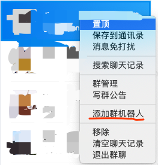
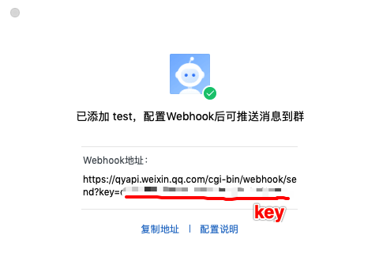
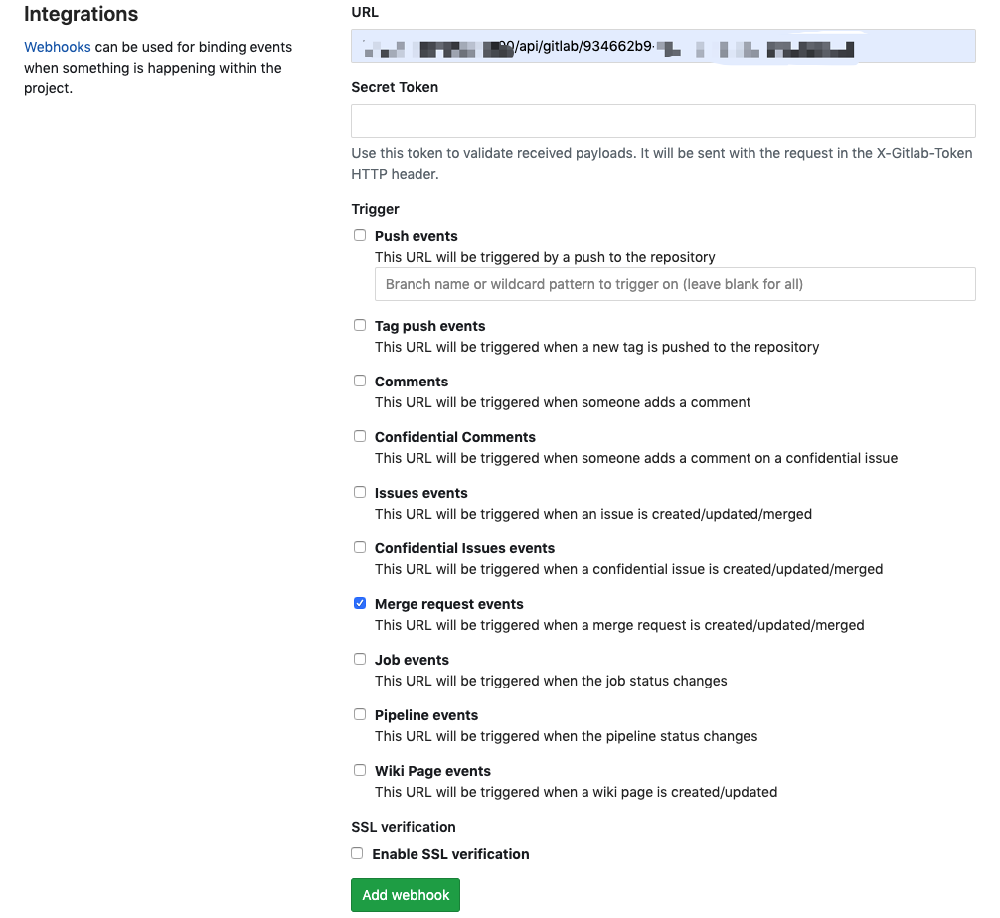
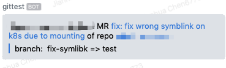

# gitlab-ww-bridge

实时转发 gitlab 通知到微信群里

> 实现 [gitlab webhook](https://docs.gitlab.com/ee/user/project/integrations/webhooks.html)，将 gitlab 通知通过
> [企业微信群机器人](https://work.weixin.qq.com/api/doc#90000/90136/91770)
> 转发到企业微信群里

## 部署服务

```bash
# install
npm i

# build
npm run build
# start serer
pm2 start ecosystem.config.js
```

Webhook url: `http://your_host:5100/api/gitlab/:wechat_bot_key`

## 配置

1. 先创建一个群机器人



复制机器人的 `key`



2. 用 `http://your_host:5100/api/gitlab/:wechat_bot_key` 格式编写对应的 `webhook url`

3. 将 `webhook url` 配置到相应的仓库上



4. 一旦有人新建或者更新该仓库的 MR，群里将会收到这样的信息



## Notes

目前只支持 `Merge Request` 通知

## TODSO

- 考虑以 docker image 发布
